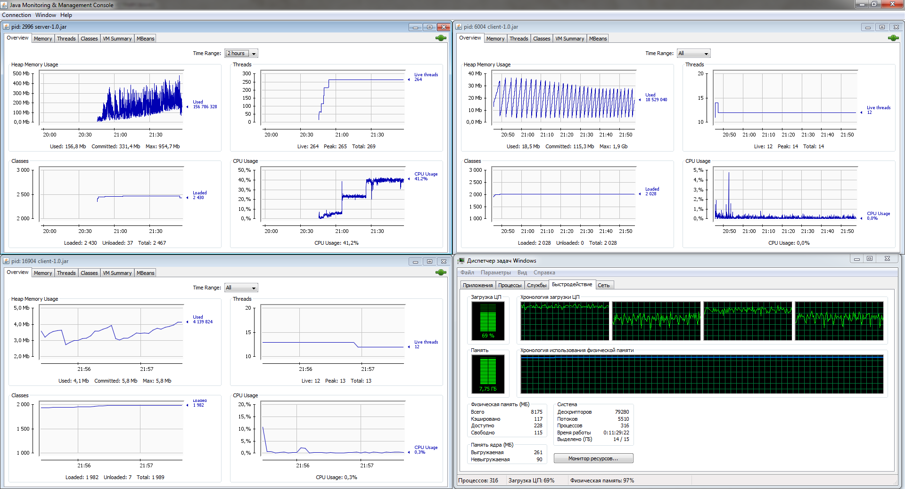

# Stress test results
The stress test was made with server and client jar packages located in the
current folder (./stress-test). After startup, client application logins to the server with random 
username and posts a message every 10 seconds in an infinite loop. 
A single instance of common console client was also started to monitor chat message flow.  
 
Local machine configuration was:
* CPU - Intel Core i5-3450 @ 3.10 GHz
* RAM - 8 GB 
* OS - Windows7 x64 SP1 

Application parameters:
* Server instance was started with VM arguments `-Xms200m -Xmx1024m`
* 250 separate java client processes were started with VM arguments `-Xms2m -Xmx5m` in bot mode.

250 client bots - were the maximum number that local machine with 8 GB RAM was able to hold. 
Each java process used about 25Mb of RAM (20mb for windows process and 5mb - for java heap). 
It can be tuned and optimized later, but now it's enough for the simple stress test. 

Here is the JConcole screenshot made after an hour and a half stress test run. 

1. Upper left - **server instance**.
    * Heap Memory Usage graph shows a slow constant increase in memory consumption. 
    It is explained by unbounded message storage that held about 100000 message after 1.5-hour test.
    At least these results ensure that the chat server will be capable of holding 1000+ clients at a common
    home PC using about a few GBs of RAM (when started without hundreds of bot clients on the same machine).
    * CPU Usage graph started very well serving 250 simultaneous clients at about 8% load. 
    But it jumped up by 20% after a half an hour, and by 20% more after an hour of the test run. 
    That behavior is inexplicable for now and requires further investigation.     
1. Upper right - **common client** instance reading the chat
    * Heap Memory Usage graph shows stable memory consumption and Garbage Collection efficiency. 
    No memory degradation can be seen.  
    * CPU Usage is pretty low and stable
1. Bottom left - one of 250 **bot clients**
    * Heap Memory Usage graph for bot client shows no memory degradation.  
    * CPU Usage is pretty low and stable
1. Bottom right - **windows task manager**
    * CPU Usage graph shows stable load. That PC could hold some more client bots if provided with more RAM
    * Windows Memory Usage graph shows stable load at maximum position.  
